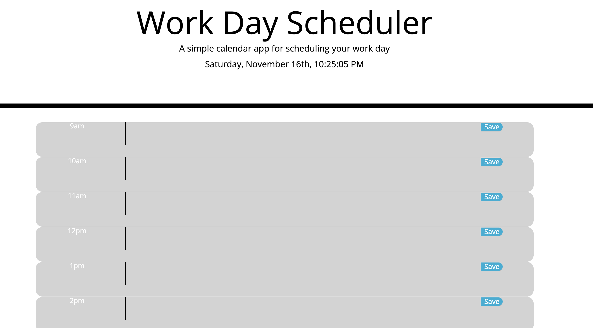

## Description
This is a day planner that allows the user to schedule a single day

Hours blocked in grey have past, the current hour is red, and future hours are green. Enter your todo item in the text area of any hour block and press the save button to save your data to local storage for call-back even if you close the application.

Link to deployed site: 
https://gvonbush.github.io/day-planner/

Screenshot of site:

## Acknowledgements

A big thanks to my tutor, Edna Jonnson, my instructors, Stetson and Donald, and my fellow classmates (I'm looking at you, Keisha) for helping me start to move in the right direction.